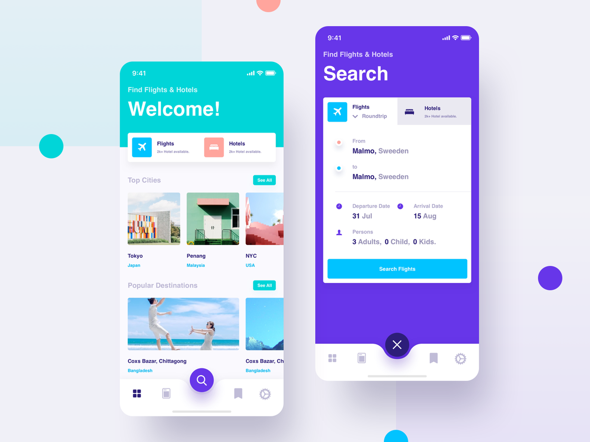

# Web Day-02 html Challenge

## Day 02

**Challenge**: HTML Full Process




이것을 클론 코딩 하십시오


### **step 1** 

- Only **Use** **`<div>` tag and `<span>` tag and ** **without** semantic tag, class and id selector. 
- (p tag, h1 tag..., a.... header..nav ❌ )
- you can **USE** **fontawesome** icon and **your image.**
- **Don't use screenshot** images

### **step 2**

- Modify **step1** contents.
- Now you can use **sematic tag**, but **don't use this**.
- **this:** 
```
<article> <aside> <details> <figcaption> <figure> <footer> <header> <main> <mark> <nav> <section> <summary> <time>
```

### **step 3**

- Modify **step2** contents.
- Now you can use **class** and **id**. 
- Don't use **this** (== **step 2 this**)
- Only **USE** [BEM](https://en.bem.info/methodology/naming-convention/)’s naming convention.

### **step 4**

- Modify **step3** contents.
- **Use All html tag** (id + class + sementic + div +span)
- Now you can **use this** (==step2 this)! 

## **requirement**: 

- **IF ANY OF THE REQUIREMENTS ARE NOT FULFILLED YOU WILL GET AN ❌**
- **you don't delete default folder**
- **이번 과제는 Step4 까지 있습니다. 모두 파이팅~~~**

**source**: [fontawesome](https://fontawesome.com/icons?d=gallery&m=free)

- ex) If you succefull
- Result: ✅
- ex) If you fail, Note ❌
- Result: ❌